# 🎫 Advanced Event Ticketing Customer Support Chatbot

<div align="center">


<h3>🚀 An intelligent, domain-specific chatbot powered by fine-tuned transformer models for seamless event ticketing support</h3>

[Live Demo](https://advanced-event-ticketing-customer-support-chatbot.streamlit.app/) • [DistilGPT2 Model](https://huggingface.co/IamPradeep/AETCSCB_OOD_IC_DistilGPT2_Fine-tuned) • [Classifier Model](https://huggingface.co/IamPradeep/Query_Classifier_DistilBERT)


</div>

---

## 📋 Table of Contents

- [Overview](#-overview)
- [Key Features](#-key-features)
- [System Architecture](#-system-architecture)
- [Model Details](#-model-details)
- [Installation](#-installation)
- [Usage](#-usage)
- [Training Pipeline](#-training-pipeline)
- [Performance Metrics](#-performance-metrics)
- [Demo](#-demo)
- [Project Structure](#-project-structure)
- [Future Enhancements](#-future-enhancements)
- [Contributing](#-contributing)
- [License](#-license)
- [Acknowledgments](#-acknowledgments)

---

## 🌟 Overview

The **Advanced Event Ticketing Customer Support Chatbot** is a sophisticated AI-powered solution designed to handle customer inquiries related to event ticketing. Built with a multi-model architecture, this system intelligently routes queries through a classification pipeline and generates contextually relevant, professional responses.

### 🎯 What Makes This Special?

```
┌─────────────────────────────────────────────────────────────────────────────┐
│                                                                             │
│   User Query ──▶ OOD Classifier ──▶ In-Domain? ──▶ DistilGPT2 ──▶ Response │
│                       │                                    │                │
│                       │                                    ▼                │
│                       │                              NER Processing         │
│                       │                                    │                │
│                       ▼                                    ▼                │
│                 Polite Rejection              Dynamic Placeholder           │
│                   Response                      Replacement                 │
│                                                                             │
└─────────────────────────────────────────────────────────────────────────────┘
```

---

## ✨ Key Features

<table>
<tr>
<td width="50%">

### 🧠 Intelligent Query Classification
- **DistilBERT-based classifier** distinguishes between in-domain and out-of-domain queries
- **99.96% accuracy** on validation set
- Graceful handling of off-topic requests

</td>
<td width="50%">

### 💬 Natural Response Generation
- **Fine-tuned DistilGPT2** for domain-specific responses
- Streaming text generation for real-time interaction
- Professional, context-aware replies

</td>
</tr>
<tr>
<td width="50%">

### 🏷️ Named Entity Recognition
- **spaCy transformer model** for entity extraction
- Automatic detection of events and locations
- Dynamic placeholder replacement

</td>
<td width="50%">

### 🎨 Beautiful UI/UX
- **Streamlit-powered interface**
- Chat-style conversation flow
- Example queries for quick start

</td>
</tr>
</table>

---

## 🏗️ System Architecture

```mermaid
graph TB
    A[👤 User Input] --> B{🔍 DistilBERT Classifier}
    B -->|Out-of-Domain| C[🚫 Polite Fallback Response]
    B -->|In-Domain| D[🏷️ spaCy NER Processing]
    D --> E[🤖 DistilGPT2 Response Generation]
    E --> F[🔄 Placeholder Replacement]
    F --> G[💬 Final Response]
    C --> G
    
    style A fill:#e1f5fe
    style B fill:#fff3e0
    style C fill:#ffebee
    style D fill:#f3e5f5
    style E fill:#e8f5e9
    style F fill:#fce4ec
    style G fill:#e0f2f1
```



### Component Breakdown

| Component | Model/Technology | Purpose |
|-----------|-----------------|---------|
| **Query Classifier** | DistilBERT (fine-tuned) | Binary classification for OOD detection |
| **Response Generator** | DistilGPT2 (fine-tuned) | Domain-specific response generation |
| **Entity Extractor** | spaCy (en_core_web_trf) | Extract events, locations from queries |
| **Frontend** | Streamlit | Interactive web interface |
| **Deployment** | Streamlit Cloud | Cloud hosting |

---

## 🤖 Model Details

### 1️⃣ Response Generator: DistilGPT2

<details>
<summary><b>Click to expand training details</b></summary>

**Base Model:** `distilgpt2`

**Training Configuration:**
```python
TrainingArguments(
    output_dir="./results",
    learning_rate=2e-4,
    per_device_train_batch_size=8,
    num_train_epochs=10,
    weight_decay=0.01,
    save_strategy="epoch"
)
```

**Dataset:**
- 30,766 instruction-response pairs
- Event ticketing domain-specific data
- Structured format: `Instruction: {query} Response: {answer}`

**Training Results:**

| Epoch | Training Loss |
|-------|--------------|
| 1 | 0.3828 |
| 5 | 0.1367 |
| 10 | 0.0864 |

**Total Training Time:** ~4 hours on GPU

</details>

### 2️⃣ Query Classifier: DistilBERT

<details>
<summary><b>Click to expand training details</b></summary>

**Base Model:** `distilbert-base-uncased`

**Training Configuration:**
```python
TrainingArguments(
    output_dir='./results',
    num_train_epochs=5,
    per_device_train_batch_size=8,
    per_device_eval_batch_size=16,
    warmup_steps=500,
    weight_decay=0.01,
    learning_rate=2e-5,
    lr_scheduler_type="linear"
)
```

**Dataset:**
- **Training:** 47,101 samples
- **Validation:** 8,312 samples
- Binary labels: In-domain (0) / Out-of-domain (1)

</details>

---

## 📊 Performance Metrics

### Query Classifier Performance

<div align="center">

| Metric | Score |
|--------|-------|
| **Accuracy** | 99.96% |
| **Precision** | 99.95% |
| **Recall** | 99.98% |
| **F1-Score** | 99.96% |

</div>

```
              precision    recall  f1-score   support

  In-Domain       1.00      1.00      1.00      4046
Out-of-Domain     1.00      1.00      1.00      4266

    accuracy                          1.00      8312
```

### Response Generator Training Progress

```
Training Loss Over Epochs:
████████████████████████████████████████████████████████████████████████████
█ Epoch 1:  ████████████████████████████████████████████  0.3828           █
█ Epoch 2:  ██████████████████████████████                0.1617           █
█ Epoch 3:  ████████████████████████████                  0.1555           █
█ Epoch 4:  ██████████████████████████                    0.1331           █
█ Epoch 5:  ████████████████████████                      0.1233           █
█ Epoch 6:  ██████████████████████                        0.1141           █
█ Epoch 7:  ████████████████████                          0.1062           █
█ Epoch 8:  ██████████████████                            0.0999           █
█ Epoch 9:  ████████████████                              0.0946           █
█ Epoch 10: ██████████████                                0.0864           █
████████████████████████████████████████████████████████████████████████████
```

---

## 🚀 Installation

### Prerequisites

- Python 3.8+
- CUDA-compatible GPU (recommended for training)
- 8GB+ RAM

### Quick Start

```bash
# Clone the repository
git clone https://github.com/MarpakaPradeepSai/Advanced-Event-Ticketing-Chatbot.git
cd Advanced-Event-Ticketing-Chatbot

# Create virtual environment
python -m venv venv
source venv/bin/activate  # On Windows: venv\Scripts\activate

# Install dependencies
pip install -r requirements.txt

# Download spaCy model
python -m spacy download en_core_web_trf

# Run the application
streamlit run app.py
```

### Dependencies

```txt
torch>=2.0.0
transformers>=4.30.0
streamlit>=1.28.0
spacy>=3.0.0
pandas>=1.5.0
datasets>=2.14.0
wandb>=0.15.0
```

---

## 💻 Usage

### Running the Chatbot

```bash
streamlit run app.py
```

### Example Interactions

<table>
<tr>
<th>User Query</th>
<th>Bot Response</th>
</tr>
<tr>
<td>

```
How can I cancel my ticket 
for the upcoming event in Mumbai?
```

</td>
<td>

```
To cancel your ticket for the event in Mumbai, 
kindly adhere to the following steps:

1. Access website and log into your account.
2. Proceed to the Ticket Cancellation section.
3. Locate your upcoming events and choose 
   the event in Mumbai.
4. Select the Cancel Ticket option.
5. Follow the on-screen instructions to 
   confirm your cancellation.

If you face any difficulties, do not hesitate 
to reach out to our customer support team.
```

</td>
</tr>
<tr>
<td>

```
What's the weather like today?
```

</td>
<td>

```
I'm sorry, but I am unable to assist with 
this request. If you need help regarding 
event tickets, I'd be happy to support you.
```

</td>
</tr>
</table>

### Programmatic Usage

```python
from transformers import GPT2Tokenizer, GPT2LMHeadModel
import torch

# Load models
model = GPT2LMHeadModel.from_pretrained("IamPradeep/AETCSCB_OOD_IC_DistilGPT2_Fine-tuned")
tokenizer = GPT2Tokenizer.from_pretrained("IamPradeep/AETCSCB_OOD_IC_DistilGPT2_Fine-tuned")

def generate_response(instruction, max_length=256):
    model.eval()
    input_text = f"Instruction: {instruction} Response:"
    inputs = tokenizer(input_text, return_tensors="pt", padding=True)
    
    with torch.no_grad():
        outputs = model.generate(
            input_ids=inputs["input_ids"],
            attention_mask=inputs["attention_mask"],
            max_length=max_length,
            temperature=0.4,
            top_p=0.95,
            do_sample=True,
            pad_token_id=tokenizer.eos_token_id
        )
    
    response = tokenizer.decode(outputs[0], skip_special_tokens=True)
    response_start = response.find("Response:") + len("Response:")
    return response[response_start:].strip()

# Example
response = generate_response("How can I get a refund for my ticket?")
print(response)
```

---

## 🔧 Training Pipeline

### Phase 1: Data Preparation

```python
from datasets import Dataset
import pandas as pd

# Load your dataset
df = pd.read_csv("event_ticketing_data.csv")

# Create HuggingFace dataset
dataset = Dataset.from_pandas(df)
# Dataset({
#     features: ['instruction', 'intent', 'response'],
#     num_rows: 30766
# })
```

### Phase 2: Response Generator Training

```python
from transformers import GPT2Tokenizer, GPT2LMHeadModel, Trainer, TrainingArguments

# Initialize
tokenizer = GPT2Tokenizer.from_pretrained('distilgpt2')
tokenizer.pad_token = tokenizer.eos_token
model = GPT2LMHeadModel.from_pretrained('distilgpt2')

# Prepare data
def prepare_data(examples):
    texts = [f"Instruction: {inst} Response: {resp}"
             for inst, resp in zip(examples['instruction'], examples['response'])]
    encodings = tokenizer(texts, truncation=True, padding='max_length', max_length=256)
    return {
        'input_ids': encodings['input_ids'],
        'attention_mask': encodings['attention_mask'],
        'labels': encodings['input_ids'].copy()
    }

# Train
trainer = Trainer(model=model, args=training_args, train_dataset=train_dataset)
trainer.train()
```

### Phase 3: Query Classifier Training

```python
from transformers import AutoModelForSequenceClassification, DistilBertTokenizerFast

# Initialize
model = AutoModelForSequenceClassification.from_pretrained(
    'distilbert-base-uncased',
    num_labels=2
)
tokenizer = DistilBertTokenizerFast.from_pretrained('distilbert-base-uncased')

# Train with custom metrics
def compute_metrics(eval_pred):
    logits, labels = eval_pred
    predictions = logits.argmax(axis=-1)
    return {
        "accuracy": accuracy_score(labels, predictions),
        "f1": f1_score(labels, predictions)
    }
```

---

## 🎬 Demo

<div align="center">

### 🌐 [Try the Live Demo](https://advanced-event-ticketing-customer-support-chatbot.streamlit.app/)

</div>

### Screenshots

<table>
<tr>
<td align="center" width="50%">

**Chat Interface**

The main chat interface with example queries dropdown

</td>
<td align="center" width="50%">

**Response Generation**

Real-time streaming response with NER integration

</td>
</tr>
</table>

---

## 📁 Project Structure

```
Advanced-Event-Ticketing-Chatbot/
│
├── 📂 models/
│   ├── distilgpt2_finetuned/          # Fine-tuned response generator
│   └── distilbert_classifier/          # Query classifier
│
├── 📂 notebooks/
│   ├── 01_data_preparation.ipynb       # Data preprocessing
│   ├── 02_gpt2_training.ipynb          # Response generator training
│   ├── 03_classifier_training.ipynb    # Classifier training
│   └── 04_evaluation.ipynb             # Model evaluation
│
├── 📂 src/
│   ├── __init__.py
│   ├── model_loader.py                 # Model loading utilities
│   ├── response_generator.py           # Response generation logic
│   ├── query_classifier.py             # OOD classification
│   ├── ner_processor.py                # Entity extraction
│   └── placeholder_handler.py          # Placeholder replacement
│
├── 📂 data/
│   ├── raw/                            # Raw training data
│   └── processed/                      # Preprocessed datasets
│
├── 📄 app.py                           # Streamlit application
├── 📄 requirements.txt                 # Dependencies
├── 📄 README.md                        # This file
└── 📄 LICENSE                          # MIT License
```

---

## 🔮 Future Enhancements

<table>
<tr>
<td>

### 🎯 Short-term Goals
- [ ] Multi-turn conversation support
- [ ] Voice input integration
- [ ] Mobile-responsive design
- [ ] Rate limiting and caching

</td>
<td>

### 🚀 Long-term Goals
- [ ] Multilingual support
- [ ] Integration with ticketing APIs
- [ ] Admin dashboard for analytics
- [ ] Custom model fine-tuning interface

</td>
</tr>
</table>

---

## 🤝 Contributing

Contributions are welcome! Here's how you can help:

1. **Fork** the repository
2. **Create** your feature branch (`git checkout -b feature/AmazingFeature`)
3. **Commit** your changes (`git commit -m 'Add some AmazingFeature'`)
4. **Push** to the branch (`git push origin feature/AmazingFeature`)
5. **Open** a Pull Request

### Development Guidelines

- Follow PEP 8 style guidelines
- Add tests for new features
- Update documentation as needed
- Use meaningful commit messages

---

## 📄 License

This project is licensed under the MIT License - see the [LICENSE](LICENSE) file for details.

---

## 🙏 Acknowledgments

<div align="center">

| Resource | Description |
|----------|-------------|
| [Hugging Face](https://huggingface.co/) | Transformers library and model hosting |
| [Streamlit](https://streamlit.io/) | Web application framework |
| [spaCy](https://spacy.io/) | NER and NLP processing |
| [Weights & Biases](https://wandb.ai/) | Experiment tracking |

</div>

---

<div align="center">

### ⭐ Star this repository if you found it helpful!

<br>

**Built with ❤️ by [Marpaka Pradeep Sai](https://github.com/MarpakaPradeepSai)**

<br>

[](https://github.com/MarpakaPradeepSai)
[](https://twitter.com/MarpakaPradeep)

</div>

---

<div align="center">

```
┌────────────────────────────────────────────────────────────────────────────┐
│                                                                            │
│   "The best way to predict the future is to create it." - Peter Drucker   │
│                                                                            │
└────────────────────────────────────────────────────────────────────────────┘
```

</div>
